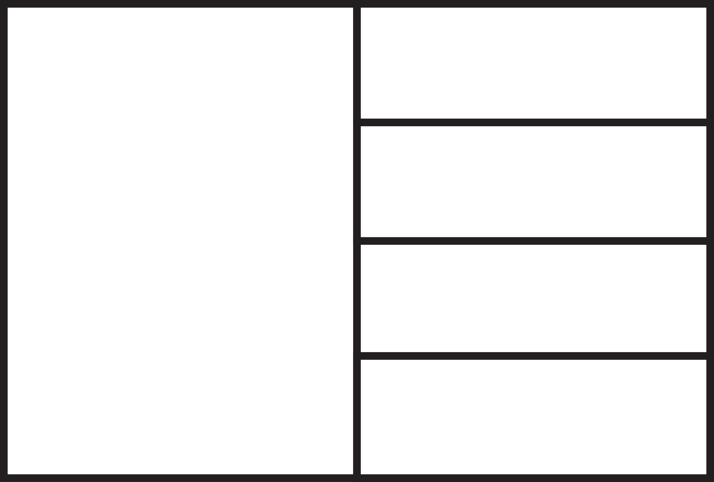
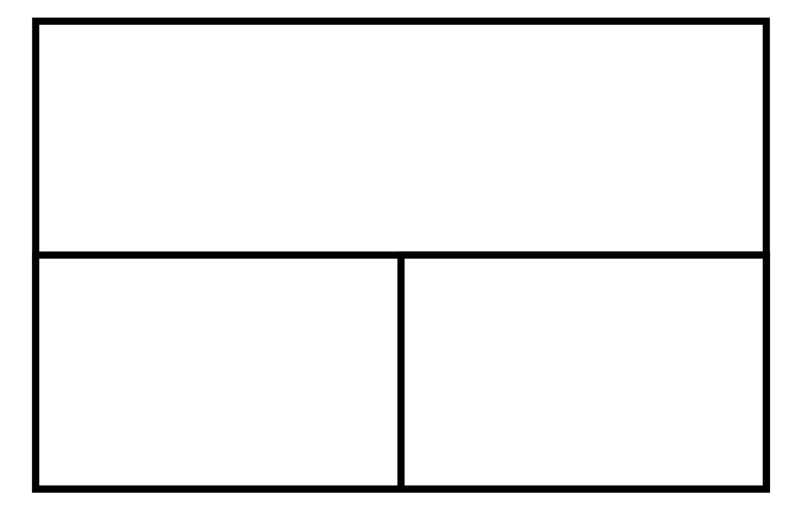
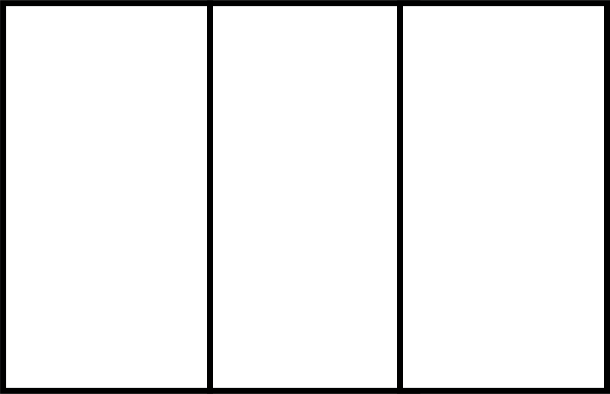
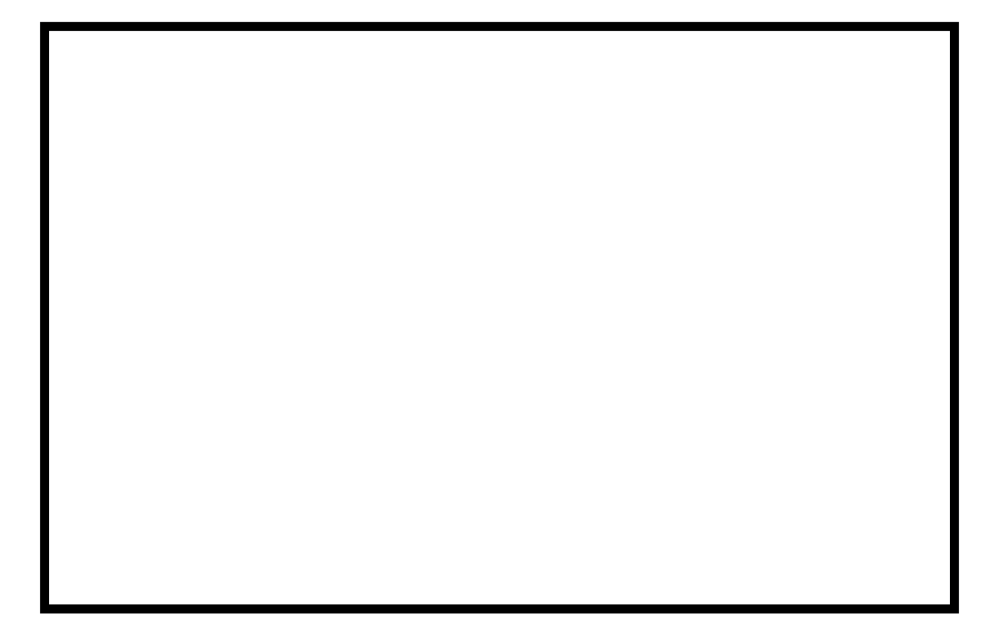
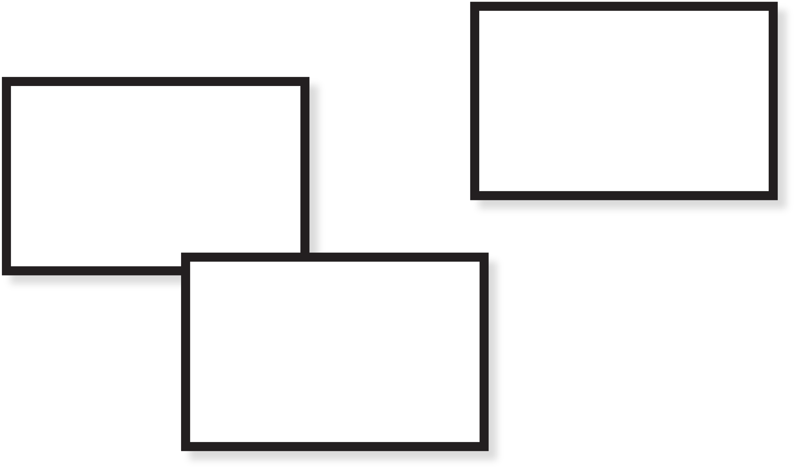
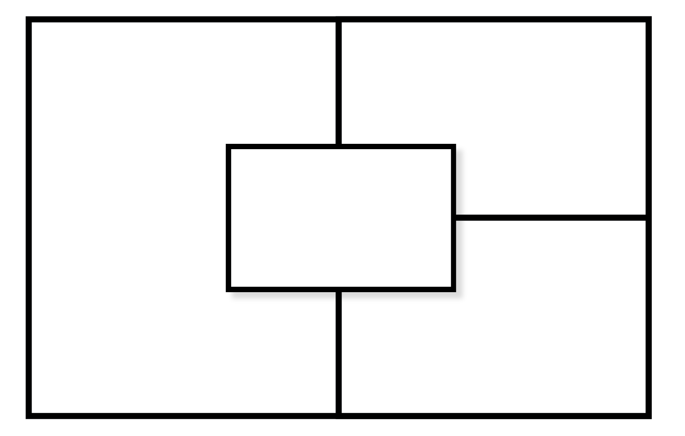

# carlywm

#

About
-----

*carlywm* is a simple dynamic tiling window manager for OSs using X as a windowing system (Linux, BSD, etc). It's written entirely in C and uses the monolithic library Xlib<sup>[1](#footy)</sup> to interact with an X server. It's not totally tiling purist -- *carlywm* supports floating windows (it'll tile and float at the same time if that's your thing, actually). Like most tiling WMs, it's keyboard-driven, fast, and a lot of fun.

It's affectionately named after [this lovely ~~goofball~~ person](http://www.imdb.com/name/nm4379768/).

Features
--------

 It's better to see how it works than to read about it, so watch the demos below!

<!-- <a href="http://www.youtube.com/watch?feature=player_embedded&v=ZxCnU6D8TNo
" target="_blank"></a> -->

#### Tiling, gaps, and focus switching:

#

#### Floating mode:

#

#### Putting a single window in floating mode while tiled:

#

#### Cycling through all the layouts:

#

#### Using an application launcher (i.e., handling a *transient* window):

#

#### Horizontal resizing:

#


[Full video link](http://www.youtube.com/watch?feature=player_embedded&v=ZxCnU6D8TNo).

<!-- [](https://www.youtube.com/watch?v=ek1j272iAmc) -->

I run it with a simple status bar (as seen in screenshots), [lemonbar](https://github.com/LemonBoy/bar), and [feh](https://github.com/derf/feh) for setting a background. There's an example *.xinitrc* in the *scripts* folder.

Layouts/Modes
-----

*carlywm* supports a few different tiling/floating modes that I found useful.

The classic *Vertical Stack*:



The not-so-classic-but-obligatory *Horizontal Stack*:



*Columns*:



*Full Screen*:



*Floating*:



*Mixed floating/tiling*:



If you're tiling and you drag a window around, it'll float and the existing windows will tile behind it, reconciling the hole left behind.

Configuration
-------------

There's a very basic file, **config.h**, where you can configure things like whether there are gaps or not, or the increment in which windows resize. You'll have to recompile after making changes, of course.

It's pretty simple:

```C
/* Size of the "Main" window in tiled layouts (percentage) */
#define MAIN_WIN_SIZE         0.50

/* Size of window borders */
#define BORDER                2

/* Whether or not there are gaps between windows */
#define GAPS                  1

/* Size of gaps */
#define GAP_SIZE              12

/* How much to adjust gaps by per keypress */
#define GAPS_INC              1

/* The number of workspaces */
#define NUM_WORKSPACES        5

/* Focus/Unfocus colors */
#define FOCUSED               "#989898"
#define UNFOCUSED             "#232c33"
```

& c.


Screenshots
-----------

#
#
#

Installation
------------

*coming soon*

Extended Window Manager Hints
-----------------------------

This is kinda there, at this point. Enough to feed the number of workspaces and the current workspace to a status bar or whatever you want. It also should recognize transient windows, such as an application launcher like [rofi](https://github.com/DaveDavenport/rofi).

Status/To-do
------------

This project is put on pause for the time being while I pursue other things.

+ bugfixes
+ more EWMH support
+ code cleanup (*bigtime*)
+ vertical resizing
+ 'true' fullscreen
+ keybinding configuration
+ installation instructions

<hr>

<a name="footy"><sup>1</sup></a>: Xlib is as old as I am and just a hoot-and-a-holler to use: I recommend [The Xlib Programming Manual](https://tronche.com/gui/x/xlib/) or joining the 21<sup>st</sup> century and beating [xcb](https://xcb.freedesktop.org/) into submission.